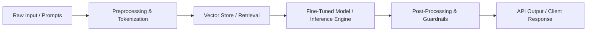

# 🚀 [Project Name] - [Short Catchy Tagline]

[](https://opensource.org/licenses/MIT)
[](https://www.python.org/downloads/)
[](https://pytorch.org/)
[](https://www.docker.com/)

> **Brief Overview**: 1-2 sentences summarizing what this AI project does, the core problem it solves, and its standout achievement (e.g. state-of-the-art benchmark, speedup, or capability).

---

## 🌟 Key Highlights & Innovations
- **Architecture**: [e.g. Built on Llama 3 / Vision Transformer / Custom Diffusion Pipeline]
- **Performance**: [e.g. 4x lower latency using TensorRT / vLLM, 94.2% F1 score]
- **Scalability**: [e.g. Asynchronous batching with Redis + FastAPI, containerized deployment]

---

## 🏗️ Architecture & Pipeline Flow



---

## 📊 Benchmark & Evaluation Results

| Model / Baseline | Metric 1 (Accuracy / F1) | Metric 2 (Latency) | VRAM Usage |
| :--- | :--- | :--- | :--- |
| Baseline (Standard) | 82.4% | 340 ms | 16 GB |
| **This Implementation** | **91.8%** | **85 ms** | **6.5 GB** |

---

## ⚡ Quickstart

### 1. Clone & Set Up Environment
```bash
git clone https://github.com/[username]/[project-repo].git
cd [project-repo]

# Using virtualenv
python -m venv venv
source venv/bin/activate  # On Windows: venv\Scripts\activate
pip install -r requirements.txt
```

### 2. Configuration
Create a `.env` file based on `.env.example`:
```env
MODEL_NAME="your-model-checkpoint"
DEVICE="cuda"
API_KEY="your_api_key_here"
```

### 3. Run Inference / API
```bash
python main.py
# Or launch the FastAPI service:
uvicorn app.api:app --host 0.0.0.0 --port 8000 --reload
```

---

## 🐳 Docker Deployment
```bash
docker build -t ai-project:latest .
docker run -p 8000:8000 --gpus all ai-project:latest
```

---

## 📜 Citation & Credits
If you use this work in your research or project, please cite:
```bibtex
@misc{author2026project,
  author = {Your Name},
  title = {[Project Name]: Title},
  year = {2026},
  publisher = {GitHub},
  journal = {GitHub repository},
  howpublished = {\url{https://github.com/[username]/[project-repo]}}
}
```
