<!--
  ============================================================
  🌟 PROFESSIONAL AI ENGINEER GITHUB PROFILE README
  ============================================================
  Ready for your custom details, GitHub username, and project showcases.
-->

<div align="center">

# 👋 Hi there, I'm <span style="color: #6366f1;">Muneeb Ali</span>

### 🚀 AI Engineer | Generative AI & Deep Learning Specialist | MLOps Enthusiast

[](https://github.com/dev-muneebali)
[](#)
[](#)

<br/><br/>

<a href="https://github.com/dev-muneebali">
  
</a>

<br/>

> *"Bridging the gap between cutting-edge AI research and scalable production systems."*

</div>

---

### 📌 About Me

- 🔭 **Currently Building:** High-throughput LLM pipelines, autonomous multi-agent workflows, and fine-tuned domain models.
- 🎯 **Areas of Expertise:** 
  - **Generative AI & LLMs:** RAG architectures, Parameter-Efficient Fine-Tuning (LoRA/QLoRA), Model Quantization, vLLM inference.
  - **Computer Vision & Multimodal:** Vision Transformers (ViT), Diffusion Models, Object Detection & Segmentation.
  - **MLOps & Engineering:** Scalable serving (FastAPI, Triton, Ray Serve), CI/CD for ML, experiment tracking (W&B, MLflow).
- 💬 **Ask me about:** PyTorch, Transformer architectures, vector search optimization, GPU acceleration, and deploying ML at scale.
- ⚡ **Fun Fact:** When I'm not tuning hyperparameters, you'll find me reading the latest arXiv papers!

---

### 🛠️ Technical Arsenal

<div align="center">

#### 🧠 Machine Learning & Deep Learning Frameworks


#### ⚙️ MLOps, Acceleration & Deployment


#### 💻 Programming Languages & Databases


#### ☁️ Cloud & Infrastructure


</div>

---

### 📂 Featured Projects

| Project | Domain / Platform | Tech Stack | Highlights & Overview | Links |
| :--- | :--- | :--- | :--- | :--- |
| **[👁️ GlaucoVision-AI](https://github.com/dev-muneebali/GlaucoVision-AI)** | Medical Computer Vision & CAD | `PyTorch` `EfficientNet-B3` `CBAM` `Grad-CAM` `Albumentations` | Multi-modal glaucoma detection & stratification with 6-channel fundus decomposition, CDR-aware loss guidance, and 0.9273 internal / 0.7887 external AUC-ROC | [Repository](https://github.com/dev-muneebali/GlaucoVision-AI) • [Research](https://github.com/dev-muneebali/GlaucoVision-AI#readme) |
| **[🐾 WhiskerBites](https://github.com/dev-muneebali/WhiskerBites)** | Mobile App / E-Commerce | `Java` `Android SDK 34` `SQLite` `Glide` `Material Design` | Native pet food & treats ordering app featuring catalog browsing, real-time cart calculations, user auth, and offline SQLite persistence | [Repository](https://github.com/dev-muneebali/WhiskerBites) • [Documentation](https://github.com/dev-muneebali/WhiskerBites#readme) |

---

### 🖥️ AI Engineering Console & Runtime

```bash
muneeb@ai-engine:~$ sysctl --status --system-profile

[+] Engineer Profile      :: Muneeb Ali (@dev-muneebali)
[+] Core Disciplines      :: Large Language Models (LLMs) • Generative AI • MLOps
[+] Acceleration Engines  :: CUDA 12.x • TensorRT • vLLM • ONNX Runtime
[+] Production Ecosystem  :: PyTorch • FastAPI • Docker • Qdrant • Ray Serve
[+] Model Compression     :: 4-bit / 8-bit Quantization (BitsAndBytes, AWQ, GGUF)
[+] Active Research Focus :: Parameter-Efficient Fine-Tuning (PEFT) & Multi-Agent RAG
[+] Deployment Targets    :: Cloud GPU Clusters & Edge Android Applications
[+] System Availability   :: [ONLINE] Ready for Advanced AI Research & Engineering
```

---

### ⚡ End-to-End AI Production Architecture

```mermaid
flowchart LR
    subgraph DataEngine["1. Data & Representation"]
        A["Raw Corpora / Multimodal Inputs"] --> B["Tokenization & Chunking"]
        B --> C["Dense Vector Embeddings"]
    end

    subgraph ModelEngine["2. Modeling & Reasoning"]
        C --> D["Foundation Models (LLMs / Vision)"]
        D --> E["LoRA / QLoRA Adapters"]
    end

    subgraph Optimization["3. Acceleration & Serving"]
        E --> F["4-bit Quantization / AWQ"]
        F --> G["vLLM / Triton Inference Engine"]
    end

    subgraph Production["4. Production Delivery"]
        G --> H["FastAPI Microservices"]
        H --> I["Guardrails, Caching & Real-Time APIs"]
    end
```



---

### 📊 GitHub Activity & Metrics

<div align="center">

[](https://github.com/dev-muneebali)
[](https://github.com/dev-muneebali)
[](https://github.com/dev-muneebali?tab=repositories)

<br/><br/>


&nbsp;


<br/><br/>


</div>

---

### 🎯 Engineering Benchmarks & Core Focus

| Focus Area | Engineering Objective | Primary Stack | Production Standard |
| :--- | :--- | :--- | :--- |
| **High-Throughput LLM Inference** | Sub-100ms Time-To-First-Token (TTFT) | `vLLM` `PagedAttention` `TensorRT-LLM` | Optimized memory utilization & continuous batching |
| **High-Precision RAG Pipelines** | Low-latency dense retrieval & reranking | `Qdrant` `BGE-M3` `LangChain` | Sub-150ms P95 semantic search with cross-encoder validation |
| **Parameter-Efficient Tuning (PEFT)** | Domain-specific adaptation on limited VRAM | `LoRA / QLoRA` `Hugging Face` `BitsAndBytes` | 4-bit quantization preserving >98% baseline accuracy |
| **Edge & Mobile AI Systems** | On-device inference & offline execution | `ONNX Runtime` `Android SDK` `SQLite` | Zero cloud latency & localized privacy preservation |

---

### 🤝 Connect & Collaborate

<div align="center">

I'm always eager to collaborate on novel AI research, open-source projects, and industry applications.

[](#)
[](#)

</div>
